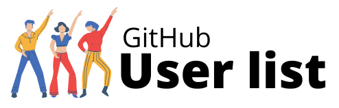
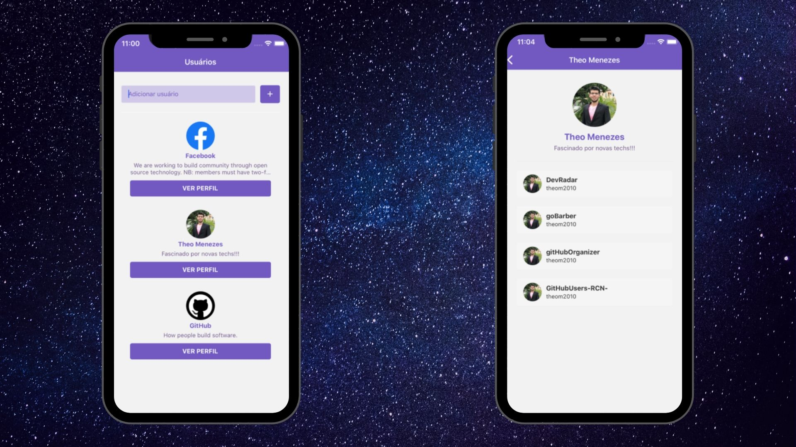

<h1 align="center">

</h1>

### Screenshot

------------

### Descrição

------------

###### GitHub User List um app onde é possível armazenar uma lista de usuários do GitHub e ver os detalhes do mesmo como: descrição, bio e repositórios favoritos.

### Tecnologias

------------
*Esse projeto foi desenvolvido com as seguintes tecnologias:*

- ###### Node.js
- ###### React Native

------------

------------

 ###### Desenvolvido por Theo Menezes no BootCamp GoStack RocketSeat.

